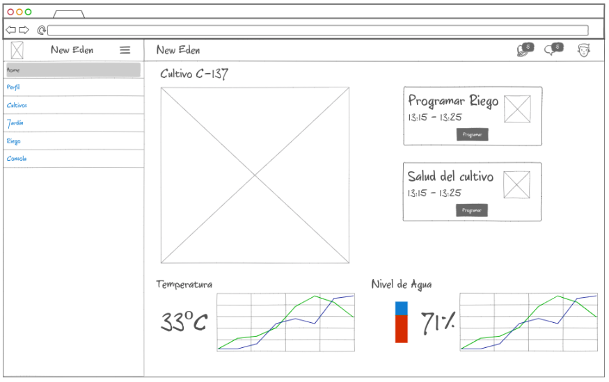

# New Eden

#### Curso Escolar 2022-2023
#### Autor: [Carlos Muñoz Iglesias](https://github.com/romitus)
#### Tutor: Angélica Mora Núñez
#### Fecha de Inicio: 26-09-2022
#### Fecha de Finalización: DD-MM-YYYY

## Breve descripción del proyecto
***

Sistema de gestión de invernaderos o reservas de agua y meteorología en zonas rurales a través de un Dashboard; mediante el uso de sensores microcontroladores y tecnología web.

## Definir el objetivo de la aplicación
***

- **¿Qué va a hacer la aplicación?**

El objetivo de este proyecto es poder automatizar cultivos o reservas de agua en un invernadero o zona rural, permitiendo almacenar lecturas de los sensores del ESP32 o ESP8266 a una base de datos, pudiendo así acceder a las lecturas desde cualquier parte del mundo a través de internet mediante un dashboard.Lo cual nos permite tomar decisiones conforme a las lecturas de datos, así como también activar y desactivar funciones; como por ejemplo permitir el paso o no de agua con una válvula solenoide conectada a un ESP32 o ESP8266.

- **¿Cuál es su atractivo principal?**

 La automatizacion y visualización de los cultivos o plantas de una jardinera.
 
- **¿Qué problema concreto va a resolver?**

 El correcto cuidado de esas plantas para que tengan buena salud.
 
- **¿Qué necesidad va a cubrir?**

 La automatización para apenas hacer mantenimiento a las plantas.

## Prototipo de la Interfaz del proyecto
***



## Estructura del Proyecto
***
En este apartado el alumno explicará el contenido del repositorio y de todas las carpetas relevantes del mismo.
```bash
├── docs
│   ├── Alcance.md
│   ├── Arquitectura_del_Proyecto
│   │   ├── Accesibilidad
│   │   ├── Mapa_de_la_Aplicación.md
│   │   └── Modelo_de_Datos
│   │       ├── Modelo de datos.pdf
│   │       └── Requisitos de la BD.docx
│   ├── Casos de Uso
│   ├── Prototipo
│   ├── README.md
│   └── Usabilidad
├── mock.png
├── README.md
└── src
    ├── app.py
    ├── config.py
    ├── controllers
    │   ├── __pycache__
    │   │   └── UserController.cpython-310.pyc
    │   ├── README.md
    │   └── UserController.py
    ├── models
    │   ├── __pycache__
    │   │   └── User.cpython-310.pyc
    │   ├── README.md
    │   └── User.py
    ├── __pycache__
    │   └── config.cpython-310.pyc
    ├── README.md
    ├── routes
    │   ├── __pycache__
    │   │   └── user_bp.cpython-310.pyc
    │   ├── README.md
    │   └── user_bp.py
    └── templates
        └── index.html
```
## Demostración del proyecto
***
```diff
Tarea en curso
```
